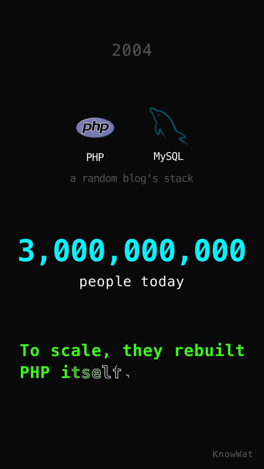

<h1 align="center">🎬 explainer-video</h1>

<p align="center">
  <em>Turn any topic into a finished, voiced, synced <strong>portrait 9:16</strong> explainer video —<br/>
  script → voiceover → optional SFX → Manim animation → composited MP4.</em>
</p>

<p align="center">
  
  
  
  
  
  
</p>

<p align="center">
  
  
</p>

<p align="center">
  <sub>↑ Real output from this skill — a 2-minute “What tech stack does Facebook use?” explainer.
  The GIF is a sped-up overview; the still is a single 1080×1920 frame.</sub>
</p>

---

Multi-agent pipeline, **free TTS** (edge-tts), no API keys. Every video is kept in
sync by a shared `timing_contract.json` so narration and visuals never drift.

## ✨ Features

- 🎙️ **Free neural voiceover** — edge-tts (Microsoft), no key or subscription
- 🎞️ **Animated with Manim** — clean, code-driven motion design
- 📱 **Portrait 9:16 (1080×1920)** — built for Reels / Shorts / TikTok
- 🔊 **Optional SFX layer** — sound cues ducked under the narration
- 🧩 **Real brand icons** — 690+ tech-stack icons for system-design videos
- 💬 **Optional burned-in captions**
- 🎨 **Themeable** — swap one JSON file to restyle the whole video

## 🚀 Install

```bash
# 1. Add this repo as a plugin marketplace
/plugin marketplace add Ahc45/explainer-video

# 2. Install the plugin
/plugin install explainer-video@explainer-video-marketplace
```

Then install the runtime prerequisites (Python, ffmpeg, manim, edge-tts) —
see **[run.md](./run.md)**. In Claude Code you can just say
*“follow run.md to install the prerequisites.”*

Invoke with `/explainer-video`.

### Simpler alternative (no marketplace)

Clone the skill straight into your skills dir:

```bash
git clone https://github.com/Ahc45/explainer-video /tmp/ev \
  && cp -r /tmp/ev/plugins/explainer-video/skills/explainer-video ~/.claude/skills/
```

## 🧰 Prerequisites

| Tool | Required? | For |
|------|-----------|-----|
| `python3`, `ffmpeg`, `manim`, `edge-tts` | ✅ core | the whole pipeline |
| `pydub` | optional | SFX mixing |
| Node + `tech-stack-icons` | optional | brand icons |
| LaTeX (MacTeX / TeX Live) | optional | `MathTex` equations |

Full setup in **[run.md](./run.md)**.

## 📂 What's inside

```
plugins/explainer-video/skills/explainer-video/
├── SKILL.md            # the pipeline instructions
├── scripts/            # voiceover, sfx_mixer, icon_fetch, compositor, run.sh
├── templates/          # theme + script scaffold
└── references/         # worked examples + sample timing contract
```

## 🔧 How it works

```
Director (Claude) ── owns timing_contract.json (the sync map)
  Script Writer  → scenes + narration + visual specs
  Voiceover      → edge-tts audio + measured durations
  SFX Mixer      → (optional) layer sound effects
  Icon Fetcher   → (optional) tech-stack icons → PNGs
  Animator       → Manim scenes, padded to narration length
  Compositor     → ffmpeg mux + normalize + concat → final.mp4
```

## 📄 License

MIT
